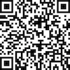
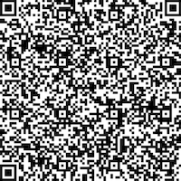

# Registry of Uniform Resource (UR) Types

## BCR-0006

**© 2020 Blockchain Commons**

Authors: Wolf McNally, Christopher Allen<br/>
Date: May 12, 2020

---

### Introduction

A limited, base-32 character set is required by Uniform Resources (UR) [BCR5] in order to be compatible with both URI syntax [RFC3986] and QR Code alphanumeric mode [QRCodeAlphaNum]. In addition, [BCR5] specifies:

> Each UR encoded object includes a `type` component as the first path component after the `UR` scheme. Types MUST consist only of characters from the English letters (ignoring case), Arabic numerals, and the hyphen `-`.

Because this namespace intersects with but does not enclose existing type namespace definitions such as [MIME] and because defined types like MIME do not uniformly specify CBOR encoding (required by [BCR5]) a new namespace is necessary to easily identify the type of data encoded in a UR.

This document is a registry of UR types. Each entry in the registry records the type string, a brief description of the type, and either a link to the type defintion or a reference to the type definition within this document. Additional types may be added by contacting this document's maintainers.

Types specified within this document are specified in [CDDL], the Concise Data Definition Language used as a human-readable notation for CBOR structures.

### User-Defined Types

All types with the prefix `x-` are reserved for user-defined UR types.

### CBOR-Wrapped Types

All types with the prefix `cbor-` are reserved for existing non-CBOR media types wrapped in a CBOR byte string. The only types currently specified in this registry are `cbor-png` for [PNG] images and `cbor-svg` for [SVG] images.

### Registry

| Type | Description | Definition |
|------|-------------|------------|
| `bytes` | Undifferentiated byte string | [[BCR5]](https://github.com/BlockchainCommons/Research/blob/master/papers/bcr-0005-ur.md) |
| `cbor-png` | PNG image | [[PNG]](https://tools.ietf.org/html/rfc2083) |
| `cbor-svg` | SVG image | [[SVG]](https://www.w3.org/TR/SVG11/) |
| `cose-sign` | COSE_Sign: Signed message (multiple recipients) | [[COSE]](https://tools.ietf.org/html/rfc8152) | 
| `cose-sign1` | COSE_Sign1: Signed message (single recipient) | [[COSE]](https://tools.ietf.org/html/rfc8152) | 
| `cose-encrypt` | COSE_Encrypt: Encrypted message (multiple recipients) | [[COSE]](https://tools.ietf.org/html/rfc8152) | 
| `cose-encrypt0` | COSE_Encrypt0: Encrypted message (implied recipient) | [[COSE]](https://tools.ietf.org/html/rfc8152) |
| `cose-mac` | COSE_Mac: Authenticated message (multiple recipients) | [[COSE]](https://tools.ietf.org/html/rfc8152) | 
| `cose-mac0` | COSE_Mac0: Authenticated message (implied recipient) | [[COSE]](https://tools.ietf.org/html/rfc8152) | 
| `cose-key` | COSE_Key: An encryption key | [[COSE]](https://tools.ietf.org/html/rfc8152) | 
| `cose-keyset` | COSE_KeySet: A set of encryption keys | [[COSE]](https://tools.ietf.org/html/rfc8152) | 
| `crypto-seed` | Cryptographic seed | This document |
| `crypto-bip39` | BIP-39 encoded seed | This document |
| `crypto-slip39` | One or more SLIP-39 shares | This document |

### Byte String `bytes`

The type `bytes` contains a single, deterministic length byte string having a length from 1 to 2^32-1 bytes. This specification places no semantic interpretation on the contents of the string. Because of this, its usefulness is generally limited to development and testing purposes. Actual applications of Uniform Resources SHOULD use a more specific type.

#### CDDL

```
bytes
```

#### Example/Test Vector

* CBOR diagnostic notation:

```
h'00112233445566778899aabbccddeeff'
```

* Encoded as binary using [CBOR-PLAYGROUND]:

```
50                                  # bytes(16)
   00112233445566778899AABBCCDDEEFF
```

* As a hex string:

```
5000112233445566778899AABBCCDDEEFF
```

* As a UR:

```
ur:bytes/5qqpzg3ng32kvaugnx4thnxaamlsmzd8wc
```

* UR as QR Code:


### Cryptographic Seed `crypto-seed`

The type `crypto-seed` contains a single, deterministic length byte string having a length from 1 to 64 bytes. Semantically, this byte string SHOULD be a random or pseudorandom sequence generated by a cryptographically-strong algorithm.

The type may also include a `birthdate` attribute which is the number of days since the Unix epoch upon which this seed was generated. This attribute is tagged with #6.100 in accordance with [CBOR-DATE].

#### CDDL

```
seed = {
	payload: bytes,
	? birthdate: date
}
payload = 1
birthdate = 2
date = #6.100(int) ; number of days since the Unix epoch
```

#### Example/Test Vector

* For a 16 byte (128-bit) seed generated on May 13, 2020, in the CBOR diagnostic notation:

```
{
  1: h'c7098580125e2ab0981253468b2dbc52',
  2: 100(18394)
}
```

* Encoded as binary using [CBOR-PLAYGROUND]:

```
A2                                     # map(2)
   01                                  # unsigned(1) payload:
   50                                  # bytes(16)
      C7098580125E2AB0981253468B2DBC52 # payload
   02                                  # unsigned(2) birthdate:
   D8 64                               # tag(100)
      19 47DA                          # unsigned(18394)
```

* As a hex string:

```
A20150C7098580125E2AB0981253468B2DBC5202D8641947DA
```

* As a UR:

```
ur:crypto-seed/5gq4p3cfskqpyh32kzvpy56x3vkmc5szmpjpj376py6zrs
```

* UR as QR Code:


### BIP-39 Encoded Seed

The type `crypto-bip39` contains an array of BIP39 words and an optional language specifier [LANG], which if omitted is taken to be `en`.

The authors also considered possibly encoding a BIP39 seed as an array of indexes into the BIP39 dictionary, but this would be redundant with simply sending the seed itself using the `crypto-seed` type above. The purpose of BIP39 is to create a mnemonic sequence, and simply encoding the sequence as a series of indexes adds no value over simply sending the seed itself.

#### CDDL

```
bip39 = {
	words: [+ bip39Word],
	? lang: text
}
words = 1
lang = 2
bip39Word = text
```

#### Example/Test Vector

* A 16 byte (128-bit) seed, encoded as BIP39:

```
shield group erode awake lock sausage cash glare wave crew flame glove
```

* In CBOR diagnostic notation:

```
{
  1: ["shield", "group", "erode", "awake", "lock", "sausage", "cash", "glare", "wave", "crew", "flame", "glove"],
  2: "en"
}
```

* Encoded as binary using [CBOR-PLAYGROUND]:

```
A2                      # map(2)
   01                   # unsigned(1) words:
   8C                   # array(12)
      66                # text(6)
         736869656C64   # "shield"
      65                # text(5)
         67726F7570     # "group"
      65                # text(5)
         65726F6465     # "erode"
      65                # text(5)
         6177616B65     # "awake"
      64                # text(4)
         6C6F636B       # "lock"
      67                # text(7)
         73617573616765 # "sausage"
      64                # text(4)
         63617368       # "cash"
      65                # text(5)
         676C617265     # "glare"
      64                # text(4)
         77617665       # "wave"
      64                # text(4)
         63726577       # "crew"
      65                # text(5)
         666C616D65     # "flame"
      65                # text(5)
         676C6F7665     # "glove"
   02                   # unsigned(2) lang:
   62                   # text(2)
      656E              # "en"
      19 47DA                          # unsigned(18394)
```

* As a hex string:

```
A2018C66736869656C646567726F75706565726F6465656177616B65646C6F636B6773617573616765646361736865676C6172656477617665646372657765666C616D6565676C6F76650262656E1947DA
```

* As a UR:

```
ur:crypto-bip39/5gqccenndp5k2mryv4nhymm4wpjk2un0v3jk2cthv94k2ervda3kkemnv96hxct8v4jxxctndpjkwmrpwfjkgampwejkgcmjv4mk2envv9kk2et8d3hhvegzvfjkux28mg75t5m2
```

* UR as QR Code:



### SLIP-39 Encoded Shares

The type `crypto-slip39` contains an array of one or more SLIP39 shares, each of which contains one or more SLIP39 words, and an optional language specifier [LANG], which if omitted is taken to be `en`.

#### CDDL for `crypto-slip39`

```
slip39 = {
	shares: [+ share],
	? lang: text
}
shares = 1
lang = 2
share = [+ slip39Word]
slip39Word = text
```

#### Example/Test Vector

* A 16-byte (128-bit) seed, encoded as SLIP-39, single group, requires 2 of three shares:

```
spend romp academic acid client predator response axle canyon category wine verify hazard elevator briefing garbage perfect database disaster broken
spend romp academic agency acne shrimp aircraft symbolic mayor true scared sharp patent ivory center fatal prize crystal lecture herd
spend romp academic always credit hairy slow obtain welcome prevent leaf company distance detect gums fishing impact prayer short formal
```

* A 16 byte (128-bit) seed, encoded as BIP39, in CBOR diagnostic notation, `lang` field omitted.

```
{
  1: [
    ["spend", "romp", "academic", "acid", "client", "predator", "response", "axle", "canyon", "category", "wine", "verify", "hazard", "elevator", "briefing", "garbage", "perfect", "database", "disaster", "broken"],
    ["spend", "romp", "academic", "agency", "acne", "shrimp", "aircraft", "symbolic", "mayor", "true", "scared", "sharp", "patent", "ivory", "center", "fatal", "prize", "crystal", "lecture", "herd"],
    ["spend", "romp", "academic", "always", "credit", "hairy", "slow", "obtain", "welcome", "prevent", "leaf", "company", "distance", "detect", "gums", "fishing", "impact", "prayer", "short", "formal"]
  ]
}
```

* Encoded as binary using [CBOR-PLAYGROUND]:

```
A1                           # map(1)
   01                        # unsigned(1) shares:
   83                        # array(3)
      94                     # array(20)
         65                  # text(5)
            7370656E64       # "spend"
         64                  # text(4)
            726F6D70         # "romp"
         68                  # text(8)
            61636164656D6963 # "academic"
         64                  # text(4)
            61636964         # "acid"
         66                  # text(6)
            636C69656E74     # "client"
         68                  # text(8)
            7072656461746F72 # "predator"
         68                  # text(8)
            726573706F6E7365 # "response"
         64                  # text(4)
            61786C65         # "axle"
         66                  # text(6)
            63616E796F6E     # "canyon"
         68                  # text(8)
            63617465676F7279 # "category"
         64                  # text(4)
            77696E65         # "wine"
         66                  # text(6)
            766572696679     # "verify"
         66                  # text(6)
            68617A617264     # "hazard"
         68                  # text(8)
            656C657661746F72 # "elevator"
         68                  # text(8)
            6272696566696E67 # "briefing"
         67                  # text(7)
            67617262616765   # "garbage"
         67                  # text(7)
            70657266656374   # "perfect"
         68                  # text(8)
            6461746162617365 # "database"
         68                  # text(8)
            6469736173746572 # "disaster"
         66                  # text(6)
            62726F6B656E     # "broken"
      94                     # array(20)
         65                  # text(5)
            7370656E64       # "spend"
         64                  # text(4)
            726F6D70         # "romp"
         68                  # text(8)
            61636164656D6963 # "academic"
         66                  # text(6)
            6167656E6379     # "agency"
         64                  # text(4)
            61636E65         # "acne"
         66                  # text(6)
            736872696D70     # "shrimp"
         68                  # text(8)
            6169726372616674 # "aircraft"
         68                  # text(8)
            73796D626F6C6963 # "symbolic"
         65                  # text(5)
            6D61796F72       # "mayor"
         64                  # text(4)
            74727565         # "true"
         66                  # text(6)
            736361726564     # "scared"
         65                  # text(5)
            7368617270       # "sharp"
         66                  # text(6)
            706174656E74     # "patent"
         65                  # text(5)
            69766F7279       # "ivory"
         66                  # text(6)
            63656E746572     # "center"
         65                  # text(5)
            666174616C       # "fatal"
         65                  # text(5)
            7072697A65       # "prize"
         67                  # text(7)
            6372797374616C   # "crystal"
         67                  # text(7)
            6C656374757265   # "lecture"
         64                  # text(4)
            68657264         # "herd"
      94                     # array(20)
         65                  # text(5)
            7370656E64       # "spend"
         64                  # text(4)
            726F6D70         # "romp"
         68                  # text(8)
            61636164656D6963 # "academic"
         66                  # text(6)
            616C77617973     # "always"
         66                  # text(6)
            637265646974     # "credit"
         65                  # text(5)
            6861697279       # "hairy"
         64                  # text(4)
            736C6F77         # "slow"
         66                  # text(6)
            6F627461696E     # "obtain"
         67                  # text(7)
            77656C636F6D65   # "welcome"
         67                  # text(7)
            70726576656E74   # "prevent"
         64                  # text(4)
            6C656166         # "leaf"
         67                  # text(7)
            636F6D70616E79   # "company"
         68                  # text(8)
            64697374616E6365 # "distance"
         66                  # text(6)
            646574656374     # "detect"
         64                  # text(4)
            67756D73         # "gums"
         67                  # text(7)
            66697368696E67   # "fishing"
         66                  # text(6)
            696D70616374     # "impact"
         66                  # text(6)
            707261796572     # "prayer"
         65                  # text(5)
            73686F7274       # "short"
         66                  # text(6)
            666F726D616C     # "formal"
```

* As a hex string:

```
A1018394657370656E6464726F6D706861636164656D6963646163696466636C69656E74687072656461746F7268726573706F6E73656461786C656663616E796F6E6863617465676F72796477696E65667665726966796668617A61726468656C657661746F72686272696566696E67676761726261676567706572666563746864617461626173656864697361737465726662726F6B656E94657370656E6464726F6D706861636164656D6963666167656E63796461636E6566736872696D706861697263726166746873796D626F6C6963656D61796F7264747275656673636172656465736861727066706174656E746569766F72796663656E74657265666174616C657072697A65676372797374616C676C656374757265646865726494657370656E6464726F6D706861636164656D696366616C776179736663726564697465686169727964736C6F77666F627461696E6777656C636F6D656770726576656E74646C65616667636F6D70616E796864697374616E6365666465746563746467756D736766697368696E6766696D70616374667072617965726573686F727466666F726D616C
```

* As a single-part UR:

```
ur:crypto-slip39/5yqc89r9wdcx2mnyv3ex7mtsdpskxctyv4kkjcmyv93kjerxvdkxjetww358qun9v3shgmmjdpex2umsdah8xetyv9uxcetxvdsku7t0de5xxct5v4nk7unev3mkjmn9vemx2unfveukv6rp0fshyergv4kx2anpw3hhy6rzwf5k2enfdenkwempwf3xzem9vacx2unxv43hg6ryv96xzcnpwdjkserfwdshxar9wfnxyun0ddjka9r9wdcx2mnyv3ex7mtsdpskxctyv4kkjcmxv9nk2mnr09jxzcmwv4n8x6rjd9khq6rpd9exxunpve6xsumed43x7mrfvdjk6ctedaexgarjw4jkvumrv9ex2er9wd5xzunsvecxzar9de6x26tkdae8jenrv4h8getjv4nxzarpd3jhqunf0fjkwcmj09ehgctvvakx2cm5w4ex2ergv4exf9r9wdcx2mnyv3ex7mtsdpskxctyv4kkjcmxv9k8wctewdnxxun9v35hgetgv95hy7tywdkx7amxda38gctfdenhwetvvdhk6et8wpex2an9de6xgmr9v9nxwcm0d4cxzmnedpjxjum5v9hxxetxv3jhgetrw3jxwatdwdnkv6tndp5kuemxd9khqctrw3n8qunp09jhyetndphhyarxvehhymtpdsyvfrq3
```

* UR as QR Code:



* As multi-part UR:

```
ur:crypto-slip39/1of3/udl8vk6qgxxtxvpr662uvckjau86wyjdyk52xmrqsrymq2lpk6usufugcu/5yqc89r9wdcx2mnyv3ex7mtsdpskxctyv4kkjcmyv93kjerxvdkxjetww358qun9v3shgmmjdpex2umsdah8xetyv9uxcetxvdsku7t0de5xxct5v4nk7unev3mkjmn9vemx2unfveukv6rp0fshyergv4kx2anpw3hhy6rzwf5k2enfdenkwempwf3xzem9vacx2unxv43hg6ryv96xzcnpwdjkserfwdshxa
ur:crypto-slip39/2of3/udl8vk6qgxxtxvpr662uvckjau86wyjdyk52xmrqsrymq2lpk6usufugcu/r9wfnxyun0ddjka9r9wdcx2mnyv3ex7mtsdpskxctyv4kkjcmxv9nk2mnr09jxzcmwv4n8x6rjd9khq6rpd9exxunpve6xsumed43x7mrfvdjk6ctedaexgarjw4jkvumrv9ex2er9wd5xzunsvecxzar9de6x26tkdae8jenrv4h8getjv4nxzarpd3jhqunf0fjkwcmj09ehgctvvakx2cm5w4ex2ergv4ex
ur:crypto-slip39/3of3/udl8vk6qgxxtxvpr662uvckjau86wyjdyk52xmrqsrymq2lpk6usufugcu/f9r9wdcx2mnyv3ex7mtsdpskxctyv4kkjcmxv9k8wctewdnxxun9v35hgetgv95hy7tywdkx7amxda38gctfdenhwetvvdhk6et8wpex2an9de6xgmr9v9nxwcm0d4cxzmnedpjxjum5v9hxxetxv3jhgetrw3jxwatdwdnkv6tndp5kuemxd9khqctrw3n8qunp09jhyetndphhyarxvehhymtpdsyvfrq3
```

* Multi-part UR as multiple QR codes:


### COSE Structures

[COSE] specifies CBOR-encoded structures for transmitting signed and/or encrypted objects. This document specifies UR types starting with `cose-` for the various COSE messages in their untagged form.

### Normative References

* [RFC3986] [Uniform Resource Identifier (URI): Generic Syntax](https://tools.ietf.org/html/rfc3986)
* [QRCodeAlphaNum] [QR Codes, Table of Alphanumeric Values](https://www.thonky.com/qr-code-tutorial/alphanumeric-table)
* [BCR5] [BCR-0005: Uniform Resources (UR): Encoding Structured Binary Data for Transport in URIs and QR Codes](https://github.com/BlockchainCommons/Research/blob/master/papers/bcr-0005-ur.md)
* [CDDL] [RFC8610: Concise Data Definition Language (CDDL): A Notational Convention to Express Concise Binary Object Representation (CBOR) and JSON Data Structures](https://tools.ietf.org/html/rfc8610)
* [BIP39] [BIP-39: Mnemonic code for generating deterministic keys](https://github.com/bitcoin/bips/blob/master/bip-0039.mediawiki)
* [SLIP39] [SLIP-0039: Shamir's Secret-Sharing for Mnemonic Codes](https://github.com/satoshilabs/slips/blob/master/slip-0039.md)
* [COSE] [RFC8152: CBOR Object Signing and Encryption (COSE)](https://tools.ietf.org/html/rfc8152)
* [CBOR-DATE] [Concise Binary Object Representation (CBOR) Tags for Date](https://datatracker.ietf.org/doc/draft-ietf-cbor-date-tag/)
* [CBOR-PLAYGROUND] [CBOR Playground](http://cbor.me)
* [LANG] [List of ISO 639-1 codes](https://en.wikipedia.org/wiki/List_of_ISO_639-1_codes)
* [PNG] [PNG (Portable Network Graphics) Specification](https://tools.ietf.org/html/rfc2083)
* [SVG] [Scalable Vector Graphics (SVG) 1.1 (Second Edition)](https://www.w3.org/TR/SVG11/)

### Informative References

* [MIME] [Multipurpose Internet Mail Extensions (MIME) Part Two: Media Types](https://tools.ietf.org/html/rfc2046)
